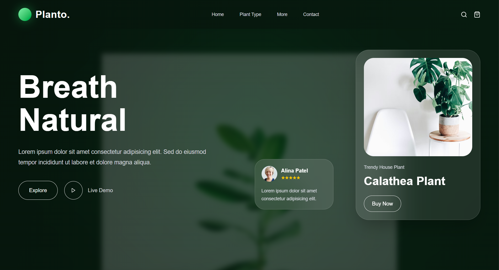
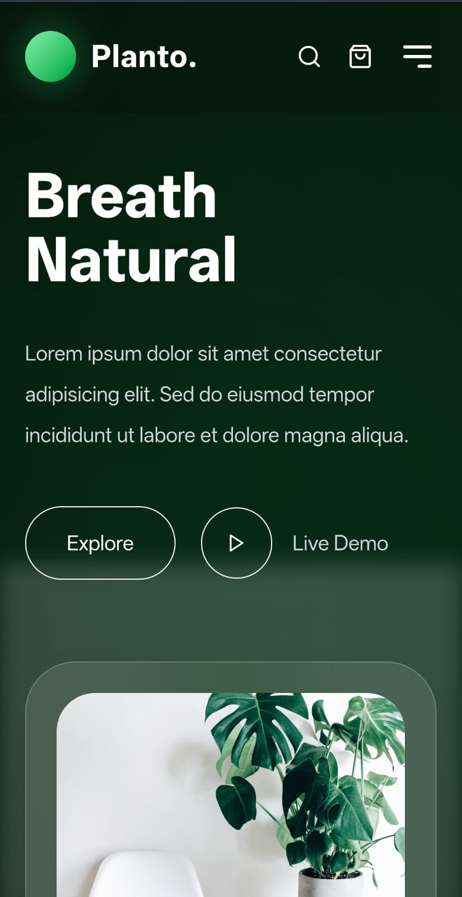

# 🌿 Planto - Plant Landing Page UI

A modern and responsive plant-themed landing page inspired by a Figma design.  
Built using React, Vite, Tailwind CSS, and reusable component architecture.

---

## 🚀 Live Demo

🔗 Live Site: https://planto-react.vercel.app/

🔗 GitHub Repository: https://github.com/harshrajsinhvaghela7586/planto-react

---

# 📸 Preview

## Desktop View



## Mobile View



---

# ✨ Features

- Modern glassmorphism UI
- Fully responsive design
- Reusable React components
- Smooth hover effects
- Clean folder structure
- Mobile-friendly layout
- Figma-inspired UI implementation
- Optimized with Tailwind CSS

---

# 🛠️ Tech Stack

- React.js
- Vite
- Tailwind CSS
- React Icons

---

# 📂 Folder Structure

```bash
src/
│
├── components/
│   ├── Navbar.jsx
│   ├── Hero.jsx
│   ├── ProductCard.jsx
│   ├── Footer.jsx
│   └── SectionTitle.jsx
│
├── sections/
│   ├── TopSelling.jsx
│   ├── CustomerReview.jsx
│   └── BestPlant.jsx
│
├── data/
│   └── products.js
│
├── App.jsx
└── main.jsx
```

---

# ⚙️ Installation & Setup

Clone the repository:

```bash
git clone https://github.com/harshrajsinhvaghela7586/planto-react.git
```

Go inside the project folder:

```bash
cd planto-react
```

Install dependencies:

```bash
npm install
```

Run development server:

```bash
npm run dev
```

Create production build:

```bash
npm run build
```

---

# 📱 Responsive Design

The website is fully responsive and optimized for:

- Desktop
- Tablet
- Mobile Devices

---
# 🎨 Design Inspiration

Inspired by a modern Figma UI design featuring glassmorphism effects, clean layouts, smooth spacing, and a premium plant-themed user interface.

---

# 📌 Submission Details

- Public GitHub Repository ✅
- Live Deployment using Vercel ✅
- Fully Responsive Design ✅
- Reusable Component Structure ✅

---

# 👨‍💻 Author

Harshrajsinh Vaghela  

🔗 LinkedIn: https://www.linkedin.com/in/harshrajsinh-vaghela-a38bba300/

---
